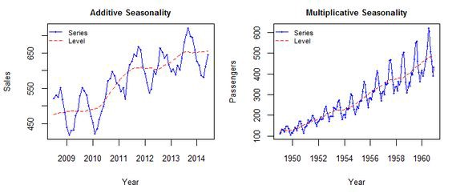

```{r setup, include=FALSE}
options(htmltools.dir.version = FALSE)
library(WDI)
library(dplyr)
library(rnaturalearth)
library(tidyverse)
library(ggplot2)
library(ggthemes)
library(ggrepel)
#library(icons)
```

```{r xaringan-themer, include=FALSE, warning=FALSE}
library(xaringanthemer)
style_mono_light(
  header_font_google = google_font("Josefin Slab", "600"),
  text_font_google   = google_font("Work Sans", "300", "300i"),
  code_font_google   = google_font("IBM Plex Mono"),
  title_slide_background_image = "all-ok.PNG",
  title_slide_background_size = "95%",
  title_slide_background_position = "bottom",
  base_color = "#000000",
  code_inline_color = "#13A10E",
  link_color = "#13A10E",
  code_font_size = "0.7em"
)
```

```{r xaringanExtra-clipboard, echo=FALSE}
xaringanExtra::use_clipboard()
```

```{r xaringanExtra-share-again, echo=FALSE}
xaringanExtra::use_share_again()
```

```{r xaringan-panelset, echo=FALSE}
xaringanExtra::use_panelset()
```

count: false

class: inverse, center, title-slide, middle

<style>
.title-slide .remark-slide-number {
  display: none;
}
</style>

# Time Series 

## Analysis and Forecasting in R

### [`Ahmed ZAHER`](https://lpnc.univ-grenoble-alpes.fr/Ahmed-ZAHER)

### &#x26f0;&#xfe0f; R in Grenoble Session

#### 24 June 2021


---

count: false

class: inverse, lift, top

# Outlines:

- What is a Time Series?

- Understanding your Time Series

- How to make a time series stationary?

- ARIMA Models

- Autocorrelation and Partial-Autocorrelation

- Forecasting Using an ARIMA Model

---

`Time Series in R`

- Any metric that is measured over regular time intervals makes a Time Series. 
e.g.: Weather data, Stock prices, Industry forecasts...

--

*Example: Economic Time Series data from ggplot2 package*


```{r ,, error=FALSE, message=FALSE, warning=FALSE }
# load economics Time Series data from ggplot2
library(ggplot2)
# Demo dataset
head(economics)

```

--

*Selecting psavert and uempmed datas*

```{r, message=FALSE, warning=FALSE, error=FALSE, fig.align='center'}
library(tidyr)
library(dplyr)
df <- economics %>%
  select(date, psavert, uempmed) %>%
  gather(key = "variable", value = "value", -date)

```

---

`Plotting Series`

```{r, message=FALSE, warning=FALSE, error=FALSE, fig.width=10, fig.height=5, fig.align='center'}
# Multiple line plot
ggplot(df, aes(x = date, y = value)) + 
  geom_line(aes(color = variable), size = 1) +
  scale_color_manual(values = c("#00AFBB", "#E7B800")) +
  theme_minimal()
```

==> Other methods to plot time series are described in the [Tutorial](https://github.com/zaher-stat/R_in_Grenoble-Time_Series_Talk)

---

`Personal savings rate time series analysis`

```{r}
# get psavert data
df <- economics %>%
  select(date, psavert)

# time period
min(df$date)
max(df$date)

# convert it to a time serie
psavert <- stats::ts(df$psavert, frequency = 12, start = c(1967, 7), end = c(2015, 4))
psavert
```

---

`Plotting Time Series Object`

```{r , fig.align='center'}
stats::plot.ts(psavert, ylab="Personal savings rate", xlab="Year")
```

---

`Components of a Time Series`

Each data point a Time Series ( $Y_t$ ) can be expressed as either a sum or a product of three components : 

==> Seasonality ( $S_t$ ), Trend ( $T_t$ ) and Error ( $\epsilon_t$ ) (a.k.a White Noise)


- Additive Time Series : $Y_t = S_t + T_t + \epsilon_t$


- Multiplicative Time Series : $Y_t = S_t * T_t * \epsilon_t$


A multiplicative time series can be converted to additive by taking a log of the time series.

--

<center>




---

`Extract components`

```{r, fig.align='center'}

decomposeTS <- stats::decompose(psavert, type = "add")
plot(decomposeTS)


```

---

`Stationary Time Series`

Being stationary requires that the mean and variance of a time series are constant for the whole series.
That can be fixed by differencing the series or by applying another transformation.

- Differencing is the process of subtracting one observation from another and can be done on any number of observations.

--

```{r, fig.align='center', fig.height=5}
psavert_SA <- psavert - decomposeTS$seasonal # Seasonally Adjusting
psavert_SA_diff1 <- diff(psavert_SA, differences = 1) # Differentiated series
## ΔGDP_t = GDP_t - GDP_{t-1}
plot(psavert_SA_diff1)
```


---

`The optimal number of diffs`

```{r, message=FALSE, warning=FALSE,error=FALSE}
library(forecast)
ndiffs(x = psavert_SA)
```

```{r, fig.align='center', fig.height=5}
plot(diff(psavert_SA, 1))
```

==> we can also chek for stationarity using statistical tests (e.g. _ADF test_)

---

`ARIMA Models`

**Auto Regressive Integrated Moving Average** is a class of models that explains a given Time Series based on its own past values (lags and lagged forecast errors). So that equation can be used to forecast future values.

--

An ARIMA model is characterized by 3 terms: $ARIMA(p, d, q)$

where :

- $p$ is the order of the $AR$ term

$$Y_t = \beta_1 Y_{t-1} + \beta_2 Y_{t-2} + ... + \beta_p Y_{t-p} + \epsilon_t$$

- $q$ is the order of the $MA$ term

$$Y_t = \epsilon_t + \theta_1 \epsilon_{t-1} + ... + \theta_q \epsilon_{t-q}$$

- $d$ is the number of differencing required to make the time series stationary

$$(1-L)^d Y_t$$

- The model equation can be writtes as follow:

$$(1 - \beta_1 L - \beta_2 L^2 - ... - \beta_p L^p) (1-L)^d Y_t = (1 + \theta_1 L + \theta_2 L^2 + ... + \theta_q L^q) \epsilon_t$$ 
$$AR(p)\qquad d\; differences\qquad MA(q) $$

---

`Selecting a condidate Model`

To do this, we need to examine the correlogram and partial correlogram of the stationary time series.

- __Correlogram__: represents the autocorrelation that measures the linear relationship between lagged values of a time series.

- __Partial correlogram__: represents the partial autocorrelation function that measures the correlation between observations of a time series that are separated by k time units ( $Y_t$ and $Y_{t–k}$ ), after adjusting for the presence of all the other terms of shorter lag ( $Y_{t–1}$, $Y_{t–2}$, ..., $Y_{t–k-1}$ ).

==> The partial autocorrelation at lag k is the correlation that results after removing the effect of any correlations due to the terms at shorter lags.

To plot a correlogram and partial correlogram, we can use the _Acf()_ and _Pacf()_ functions in R.

---

`Selecting a condidate Model`

**Correlogram for psavert Time Series**


```{r, message=FALSE, warning=FALSE, error=FALSE, fig.height=4, fig.width=6, fig.align='center'}

Acf(psavert_SA_diff1, lag.max=20)             # plot a correlogram
Acf(psavert_SA_diff1, lag.max=20, plot=FALSE) # get the autocorrelation values

```


---

`Selecting a condidate Model`

**Partial correlogram for psavert Time Series**

```{r, message=FALSE, warning=FALSE, error=FALSE, fig.height=4, fig.width=6, fig.align='center'}

Pacf(psavert_SA_diff1, lag.max=20)             # plot a partial correlogram
Pacf(psavert_SA_diff1, lag.max=20, plot=FALSE) # get the partial autocorrelation values

```


---

`Selecting a condidate Model`


Since the correlogram is zero after lag 4, and the partial correlogram tails off to zero after lag 3, this means that the following __ARMA__ (autoregressive moving average) models are possible for the time series of first differences:

--

- an __ARMA(3,0)__ model, that is, an autoregressive model of order p=3, since the partial autocorrelogram is zero after lag 3, and the autocorrelogram tails off to zero 

--

- an __ARMA(0,4)__ model, that is, a moving average model of order q=4, since the autocorrelogram is zero after lag 4 and the partial autocorrelogram tails off to zero

--

- an __ARMA(p,q)__ model, that is, a mixed model with p and q greater than 0, since the autocorrelogram and partial correlogram tail off to zero ( $0 < p,q \leq 4$ )

--

==> To choose the best model, we generally use the principle of parsimony, while respecting the assumptions of the ARIMA models (uncorrelated and normally distributed errors).

---

`Automatic selection`

```{r}

## Automatic processing
fit <- auto.arima(psavert_SA)
summary(fit)

```

--

The __ARIMA(0, 1, 4)__ model is selected and estimated using _auto.arima()_ function (with  Maximum Likelihood Estimation Method). Its mathematical formula is the following:

$$\Delta_1 psavert\_SA = \epsilon_t - 0.342 \epsilon_{t-1} - 0.146 \epsilon_{t-2} - 0.110 \epsilon_{t-3} + 0.114 \epsilon_{t-4}$$

---

`Forecasting`

_forecast()_ function is used to make prediction for the next five following periodes (short-term forecasts):

```{r message=FALSE, warning=FALSE, error=FALSE, fig.height=4, fig.width=6, fig.pos='center'}

forecastedValues <- forecast(fit, h=15)
plot(forecastedValues)

forecastedValues$mean

```


---

```{r echo=FALSE}
# Histogramme avec la courbe de distribution

plotForecastErrors <- function(forecasterrors)
  {
     # make a histogram of the forecast errors:
     mybinsize <- IQR(forecasterrors)/4
     mysd   <- sd(forecasterrors)
     mymin  <- min(forecasterrors) - mysd*5
     mymax  <- max(forecasterrors) + mysd*3
     # generate normally distributed data with mean 0 and standard deviation mysd
     mynorm <- rnorm(10000, mean=0, sd=mysd)
     mymin2 <- min(mynorm)
     mymax2 <- max(mynorm)
     if (mymin2 < mymin) { mymin <- mymin2 }
     if (mymax2 > mymax) { mymax <- mymax2 }
     # make a red histogram of the forecast errors, with the normally distributed data overlaid:
     mybins <- seq(mymin, mymax, mybinsize)
     hist(forecasterrors, col="red", freq=FALSE, breaks=mybins)
     # freq=FALSE ensures the area under the histogram = 1
     # generate normally distributed data with mean 0 and standard deviation mysd
     myhist <- hist(mynorm, plot=FALSE, breaks=mybins)
     # plot the normal curve as a blue line on top of the histogram of forecast errors:
     points(myhist$mids, myhist$density, type="l", col="blue", lwd=2)
}


```


`Model validation`

==> Check whether the forecast errors (residuals) are uncorrelated and normally distributed with a mean zero and a constant variance:

```{r message=FALSE, warning=FALSE, error=FALSE, fig.show="hold", out.width="50%"}

Acf(forecastedValues$residuals, lag.max=20)
plotForecastErrors(forecastedValues$residuals)

```


---

count: false

class: inverse, center

<br><br><br><br><br><br>

.center[
# Thank you!

## &#x26f0;&#xfe0f; R in Grenoble Session

### Time Series


]

